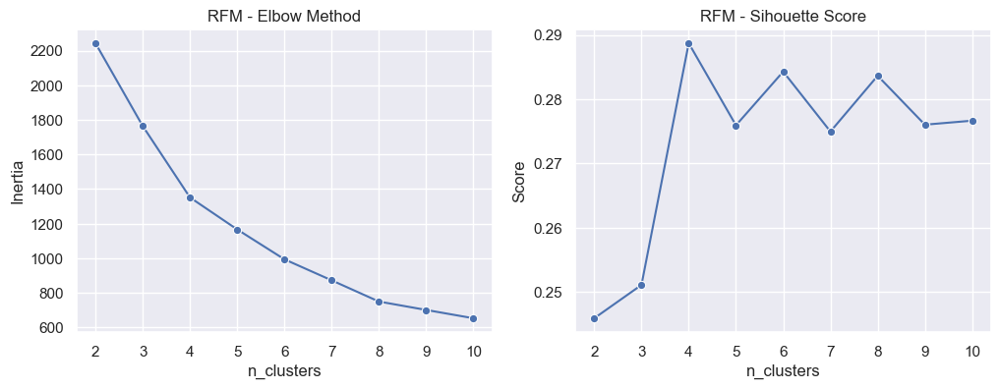

# 1 Background and Objective
In this project the objective is to find an optimal method to cluster customers based on ecommerce data.
  
Clustering plays a crucial step in marketing by differentiating customers based on psychological (e.g. satisfaction), demographic (e.g. age) or/and behavioural (e.g. last activity) factors. The objective of clustering is to tailor marketing activities, such as advertising or social media activities to the specific characteristics of each segment. The overall goal is to allocate ressources, particularly finacial ressources optimally.
  
The dataset stems from kaggle: https://www.kaggle.com/datasets/salahuddinahmedshuvo/ecommerce-consumer-behavior-analysis-data
  
This project is licensed under the terms of the Creative Commons Attribution 4.0 license (CC-BY-4.0)

# 2 Data Structure

The raw dataset has 1000 entries with 28 columns, which can be divided into demographic, psychological and behavioural factors:

1. `demographics`: Gender, Age, Marital, Status, Occupation, Income Level, Education Level, Location, Customer ID

2. `psychographics`: Brand Loyalty, Product Rating, Discount Sensitivity, Customer Satisfaction 
 
3. `behavioral`: Device Used for Shopping, Payment Method, Discount Used, Purchase Intent, Social Media Influence, Engagement with Ads, Purchase Amount, Frequency of Purchase, Time Spent on Product Research, Return Rate, Time to Decision, Purchase Channel, Purchase Category, Customer Loyalty Program Member, Shipping Preference

# 3 Executive Summary
## 3.1 Initial Clustering
The process of finding an optimal solution started with the question of wether natural clusters could be identified within the data. Therefore two cluster methods were used: <b>Hierarchical Clustering</b> and <b>DBSCAN</b>. The methods were chosen because of the mixed data types, the data contains - i.e. nominal, ordinal and metric data. Other clustering methods can not handle mixed data types. The popular K-Means algorithm is not suitable for categorical data, because it uses euclidean distance to measure the distance between the data points and assume therefore continuous values. K-Modes and K-Prototype are also not suitable for clustering this type of data. They can handle only continuous and/or nominal data, but not ordinal data. 

Hierarchical Clustering and DBSCAN can use precomputed distance matrices as a metric method. For this reason the <b>gower distance</b> were computed and was set as a precomputed metric into the cluster algorithms. Moreover, algorithm like K-Means or K-Modes do not support precomputed matrices as input.

Exploring the data with regard to its distribution indicated, that no natural and distinct clusters in the data could be found. Furthermore, the non significant distribution of the data made it also difficult to select appropriate features for the algorithms. At least, the correlation analysis showed that there was no intercorrelation between the features.

The assumption, that no distinct clusters can be found was confirmed after performing Hierarchical Clustering and DBSCAN. In both algorithms, the Silhouette Score only showed a score of 0.0187 and -0.1612, respectively (see Plot). the Silhoutte Score is a mathematical measure of the average distance from one point to all other points within the same cluster and the average distance to the points from the closest cluster. The score goes from -1 to 1. Values close to 1 indicate that the clusters are well seperated while a value close to -1 means that many values have been assigned to the wrong cluster. A value close to zero suggests that that the points lie on the boundary between clusters. The scores of 0.0187 and -0.1612, respectively can be therefore considered as low.

To reduce the effect in higher dimensions ('curse of dimensionality') a Principal Component Analysis (PCA) was performed using 2 principal components. But even there, the plot didn´t show any distinct clusters. The unsatisfying result raised the question which method can be used to cluster the data. The decision felt on the RFM-Segmentation, which will be summarized in the next part.

## 3.2 RFM Segmentation

The RFM Segmentation is a popular and widely used segmentation method in marketing that relies only on three variables:

* R (Recency): How recently a customer made a purchase.
* F (Frequency): How often a customer makes a purchase.
* M (Monetary): The total amount a customer has spent. 

Each of the variables will then divided in equally sized groups. The number of groups must be select in advance. Afterwards, each customer will get a RFM Score, which is just a merge of the three variables. Let´s say there are 5 groups and a customer have the following values: R=3; F=5;M=1. Then the rfm score is 351. Based on this score each customer falls in the end in different segments.

This method provides a pragmatic approach to categorizing customers based on these variables. However, this process of segmentation appears somewhat abritrary because there is a risk of creating artificial segments where no natural distinction actually exists. To minimize this risk the RFM method was extended by the KMeans algorithm that try to find distinct segments in the data.

### 3.2.1 Segmentation with KMeans

In this project R is reflected by the variable 'Last_Activity (days)' which is a transformation of the original variable Time_of_Purchase. F is reflected by the variable 'Frequency_of_Purchase' and M is reflected by 'Purchase_Amount'. In context of machine learning using the rfm variables for KMeans can also be seen as a feature selection method.

With KMeans clustering it is necessary to define the optimal number of clusters in advance. One common technique for determining the optimal number is the elbow method which provides a visual approach. By increasing the number of clusters the optimal number is identified where the curve starts to level off, indicating the model will no longer improve significantly with additional clusters. Looking at the above left plot this improvement is reached at cluster number 4. As can be seen in the plot(right), the Silhoutte Score shows an acceptable value of about 0.29 at the cluster number 4 and validate the finding of the elbow method. Based on this result KMeans will be executed with 4 clusters. 

### 3.2.2 Segment Description

The median value of each feature within each cluster is as follows:

Based on these values, the following segments can be identified:

1. Cluster 0 -> `Occasional Shopper`: 
    * Recent activ 
    * low frequency of purchase 
    * low purchase amount
2. Cluster 1 -> `Inactive Premium`: 
    * Not activ and 
    * low frequency of purchase 
    * high Amount of Purchase
3. Cluster 2 -> `Top Customer`: 
    * Recent activ with 
    * high frequency of Purchase 
    * high Purchase Amount
4. Cluster 3 -> `Frequent Low-Spender`: 
    * Middle last activ 
    * high frequency of purchase 
    * lowest purchase amount

# 4 Conclusion

